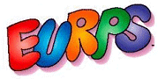

# Home

Everything you wanted to know and more about the elusive Alphabet Eurps.

Click on the navigation menu on the left for a deep dive into the lore for each one of the Alphabet Eurps!

The Eurps are the amazing, magical alphabet family from Eurpsville. From adventurous Ace to zippy Zeke, each of the 26 characters has his or her own distinct personality. When the Eurps stand together in special ways, they form words. And words are MAGIC. The Eurps promote the power and magic of letters, words, spelling and reading to children. Joined by their human friend, Bipple, the Eurps take children on many entertaining and educational adventures.

The Eurps are my very special alphabet family. Children will laugh at the amusing stories and playful characters as they learn, while having fun with words and reading.
